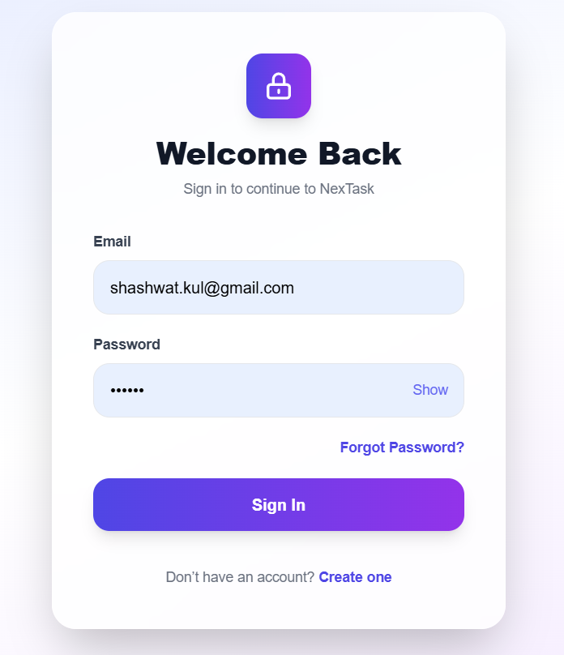
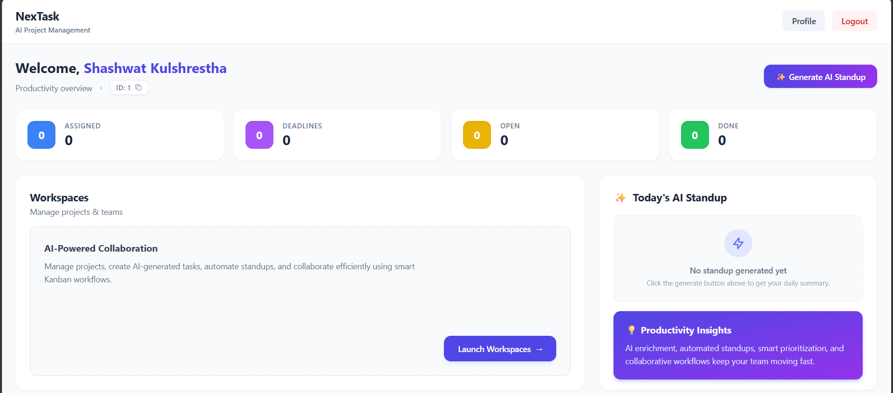
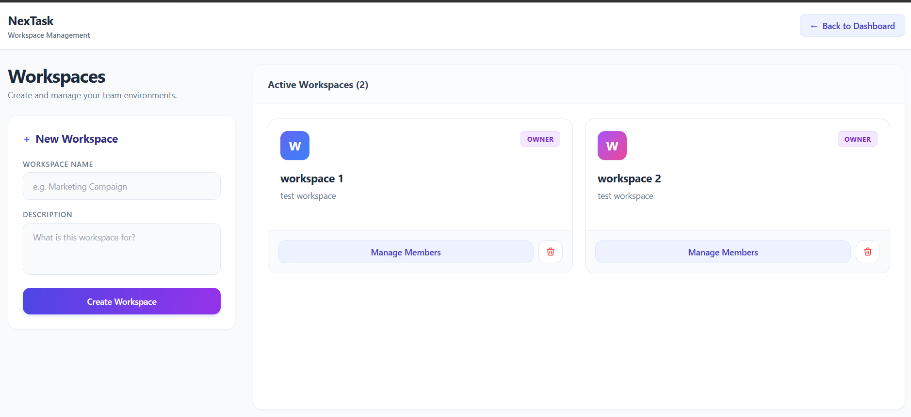
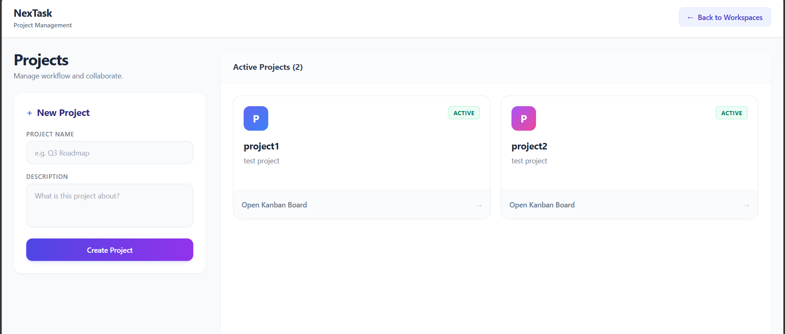
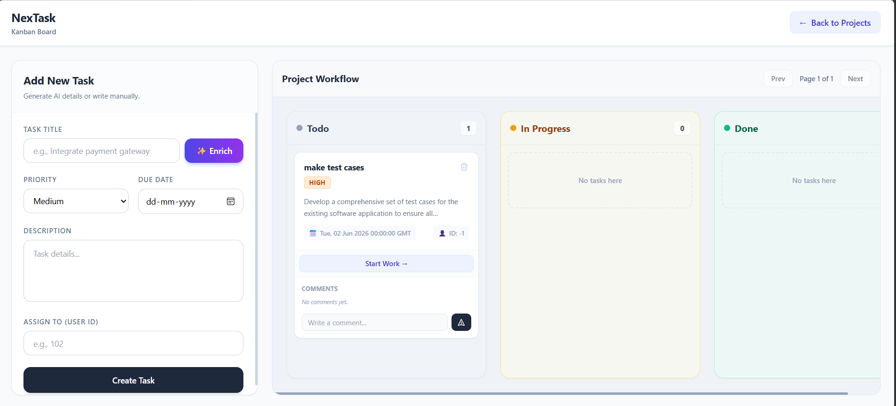

# NexTask 🚀

AI-Powered Project Management Platform

NexTask is a full-stack collaborative project management application that enables teams to manage workspaces, projects, tasks, and team collaboration through an intuitive Kanban workflow. The platform integrates AI-powered productivity features such as task enrichment and automated standup generation to improve planning, execution, and team communication.

---

# Features

## Authentication & User Management

* User Registration
* User Login
* JWT Authentication
* Access Token & Refresh Token Support
* Secure Logout
* Session Persistence
* Profile Management
* Password Hashing using Bcrypt

---

## Workspace Management

* Create Workspaces
* Add Members via Email
* Assign Roles:

  * Owner
  * Admin
  * Member
* Update Member Roles
* Remove Members
* Owner-Only Workspace Deletion

---

## Project Management

* Create Projects inside Workspaces
* Multiple Projects per Workspace
* Organized Team Collaboration

---

## Task Management

* Kanban Board Interface
* Create Tasks
* Update Tasks
* Delete Tasks
* Assign Tasks to Users
* Task Priorities
* Due Dates
* Status Tracking
* Comments System
* Activity Logging

---

## Dashboard

The dashboard provides a real-time overview of productivity metrics.

### Metrics

* Assigned Tasks
* Open Tasks
* Completed Tasks
* Overdue Tasks
* Upcoming Deadlines
* Total Projects
* Total Workspaces

---
# 📸 Screenshots

## Login


User login along with registration.


## Dashboard



Real-time productivity metrics, AI standup generation, and quick actions.

---

## Workspaces



Create and manage collaborative workspaces with role-based access control.

---

## Projects



Organize work into projects within each workspace.

---

## Kanban Board



Manage tasks through an intuitive drag-and-drop workflow.

---

# AI Features

## 1. AI Task Enrichment

### Objective

Convert rough task titles into structured engineering task briefs.

### Example Input

```text
Fix login bug
```

### AI Output

```json
{
  "description": "Investigate and resolve issues preventing users from logging into the application.",
  "acceptance_criteria": [
    "Users can log in successfully",
    "Errors are displayed for invalid credentials",
    "Login works across supported browsers"
  ],
  "priority": "high",
  "suggested_labels": [
    "bug",
    "authentication",
    "login"
  ]
}
```

### AI Workflow

1. User enters a task title.
2. User clicks "AI Generate".
3. Backend sends request to OpenRouter/OpenAI.
4. AI returns structured JSON.
5. Form fields are automatically populated.

### Prompt Engineering Strategy

The system prompt enforces:

* Strict JSON output
* Schema validation
* Anti-hallucination instructions
* Controlled priority values
* Acceptance criteria generation
* Contextually relevant labels

### Failure Handling

* Missing task title validation
* API exception handling
* Invalid JSON handling
* User-friendly error messages

---

## 2. AI Standup Generator

### Objective

Generate structured daily standup reports from user task activity.

### Output Format

```text
YESTERDAY
- Completed work summary

TODAY
- Planned work summary

BLOCKERS
- Overdue tasks
- High priority pending tasks
```

### Workflow

1. User clicks "Generate AI Standup".
2. Backend collects task context.
3. AI summarizes progress.
4. Structured standup report is displayed.

### Context Management Strategy

Current implementation uses:

* Completed Tasks
* In Progress Tasks
* Overdue Tasks

The system prioritizes:

* Recently completed work
* Active tasks
* Blocking issues

This reduces prompt size while preserving relevant context.

### Failure Handling

* Empty task states handled gracefully
* No fabricated tasks
* Error responses surfaced to users

---

# Technology Stack

## Frontend

* React.js
* React Router
* Axios
* Tailwind CSS

### Why?

* Component-based architecture
* Fast development workflow
* Responsive UI design
* Efficient state management

---

## Backend

* Flask
* Flask JWT Extended
* SQLAlchemy
* Flask CORS
* Bcrypt

### Why?

* Lightweight architecture
* REST API friendly
* Easy AI integration
* Strong authentication support

---

## Database

* SQLite (Development)
* PostgreSQL Ready

### Database Entities

* Users
* Workspaces
* Workspace Members
* Projects
* Tasks
* Comments
* Activity Logs

---

## AI Layer

* OpenRouter API
* OpenAI-Compatible SDK

### Why?

* Flexible model access
* Easy integration
* Structured output generation

---

# Architecture Overview

```text
Frontend (React)
       │
       ▼
REST APIs (Flask)
       │
       ▼
Authentication Layer (JWT)
       │
       ▼
Business Logic
       │
       ▼
Database (SQLAlchemy)
       │
       ▼
AI Services (OpenRouter/OpenAI)
```

---

# API Documentation

## Authentication

### Register

```http
POST /api/auth/register
```

### Login

```http
POST /api/auth/login
```

### Refresh Token

```http
POST /api/auth/refresh
```

### Profile

```http
GET /api/profile
PUT /api/profile
```

---

## Workspaces

```http
GET    /api/workspaces
POST   /api/workspaces
DELETE /api/workspaces/:id
```

---

## Projects

```http
GET  /api/projects/:workspaceId
POST /api/projects
```

---

## Tasks

```http
GET    /api/tasks/:projectId
POST   /api/tasks
PUT    /api/tasks/:id
DELETE /api/tasks/:id
```

---

## AI Endpoints

### Task Enrichment

```http
POST /api/ai/enrich-task
```

Request:

```json
{
  "title": "Fix login bug"
}
```

---

### Standup Generator

```http
GET /api/ai/generate-standup
```

---

# Environment Variables

Create a `.env` file inside the backend directory.

```env
OPENAI_API_KEY=your_api_key

JWT_SECRET_KEY=your_secret_key
```

---

# Local Setup

## Clone Repository

```bash
git clone https://github.com/your-username/NexTask.git
```

---

## Backend Setup

```bash
cd backend

python -m venv venv

venv\Scripts\activate

pip install -r requirements.txt

python app.py
```

Backend runs on:

```text
http://127.0.0.1:5000
```

---

## Frontend Setup

```bash
cd frontend

npm install

npm run dev
```

Frontend runs on:

```text
http://localhost:5173
```

---

# Tradeoffs & Limitations

### Current Optimizations

* Simpler architecture for maintainability
* Lightweight AI context management
* Fast response times

### Future Improvements

* Activity-log based standup generation
* Real-time notifications
* File attachments
* Sprint planning AI
* Team analytics
* Advanced filtering
* Project-specific permissions

---

# Future Enhancements

* AI Sprint Planning
* AI Risk Detection
* AI Project Health Monitoring
* Calendar Integration
* Real-Time Collaboration
* WebSocket Notifications
* Dark Mode

---

# Author

**Shashwat Kulshrestha**

B.Tech Information Technology
Full Stack Developer | AI Enthusiast

---

# License

This project is licensed under the MIT License.
